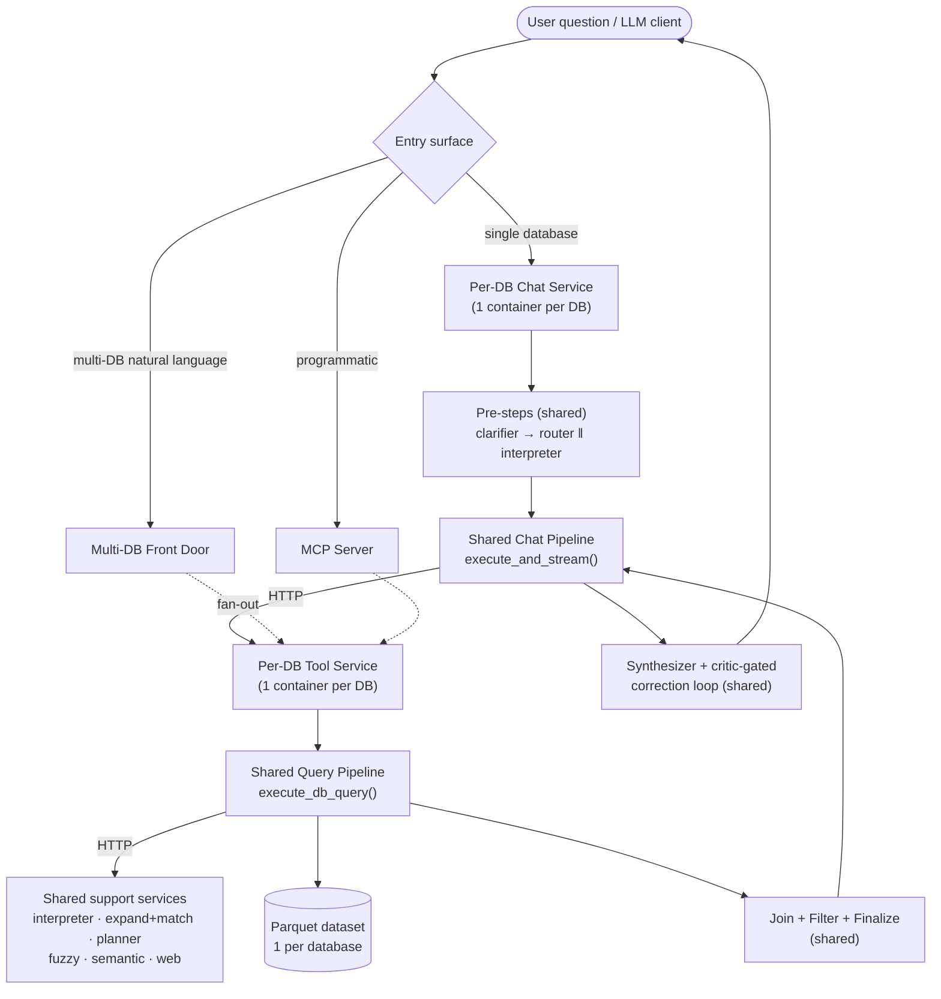
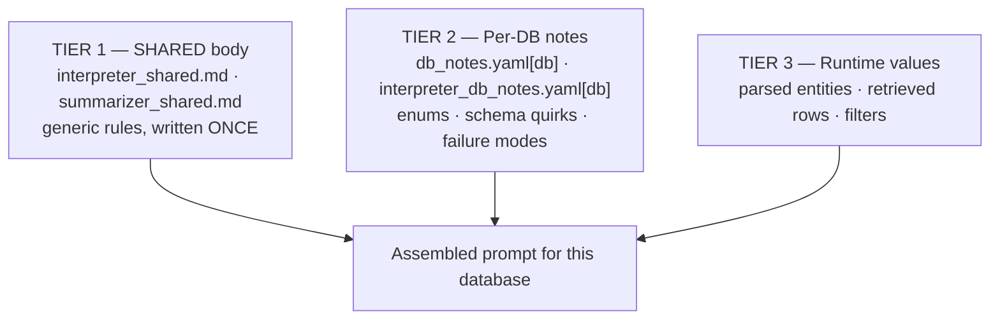

# BioChirp — Architecture Overview

BioChirp is a federated biomedical question-answering system over **~28 curated
databases**. Its design goal: **adding a new dataset requires almost no new code** —
every database reuses one shared engine and contributes only a thin, declarative
plug-in.

---

## 1. The core idea — Shared Engine + Per-Database Plug-ins

The system is split into two layers. The **Shared Engine** is written once and
never duplicated. A **Per-Database Plug-in** is the *only* thing that grows when
a new dataset is added.

```mermaid
flowchart LR
    subgraph CORE["SHARED ENGINE — written ONCE, reused by every database"]
      direction TB
      F1["Chat-service factory<br/>per_db_chat/_main.py"]
      F2["Tool-service factory<br/>per_db_tool/_main.py"]
      F3["Query pipeline<br/>execute_db_query()"]
      F4["3-tier prompt builder"]
      F5["Shared support services<br/>interpreter · expand+match · planner<br/>fuzzy · semantic · web · redis"]
      F6["One Dockerfile.service<br/>+ shared base image"]
    end

    subgraph PLUG["PER-DATABASE PLUG-IN — all you add for a new dataset"]
      direction TB
      G1["manifest.yaml<br/>ports · tables · schema"]
      G2["worker DB.py<br/>thin file · optional hooks only"]
      G3["db_notes.yaml entry<br/>per-DB prompt notes"]
      G4["parquet files<br/>the data"]
    end

    PLUG -->|"gen_compose.py<br/>+ registry entry"| CORE
    CORE --> OUT["New database is LIVE<br/>chat + tool + MCP surfaces<br/>ZERO new orchestration code"]
```

**Why this scales:** orchestration, HTTP wiring, CORS, logging, the query
pipeline, the synthesizer, the critic — all live in the Shared Engine. A new
database never touches them.

---

## 2. Runtime request flow

A user question flows top-to-bottom through shared components; only the shaded
*Per-DB* boxes are database-specific.

The Per-DB Tool Service plugs its database-specific logic into
`execute_db_query()` through a small set of **optional hooks** — everything else
(DB load, expand, planner call, join, CSV write, finalize) is shared.

---

## 3. The 3-tier prompt system

Every LLM stage (interpreter, orchestrator, summarizer) assembles its prompt
from three tiers. The generic rules are written once; each database contributes
only a small notes block.

**Why this scales:** to teach the system a new database's vocabulary you edit
*one YAML block* — not a prompt file, not code.

---

## 4. Adding a new dataset — the recipe

Adding **database #29** requires **no new orchestration code**:

| Step | Artifact | Effort |
|------|----------|--------|
| 1 | `dbs/<db>/manifest.yaml` — ports, tables, column schema | declarative |
| 2 | `app/tools/<db>/app/<db>.py` — thin worker (optional hooks only) | ~tens of lines |
| 3 | `db_notes.yaml` + `interpreter_db_notes.yaml` entry — Tier-2 prompt notes | declarative |
| 4 | parquet data files | data only |
| 5 | run `scripts/gen_compose.py` — regenerates docker-compose + registry | automated |

The shared factories then produce the new chat service, tool service, and MCP
tool automatically. Each runs from the **same `Dockerfile.service`** on the
**same shared base image**.

---

## 5. Key design properties

- **Uniform microservices** — every database is one tool service + one chat
  service, identical in shape.
- **Single source of orchestration** — the request pipeline exists once
  (`execute_db_query`, `execute_and_stream`); bug fixes and features land for
  all databases at once.
- **Declarative extension** — manifests and YAML notes, not code, define a
  database.
- **Hook-based customization** — database-specific quirks plug into the shared
  pipeline as small optional hooks, never as forked pipelines.
- **Shared support services** — entity resolution, fuzzy/semantic matching,
  planning, and web fallback are centralized and reused.
- **Multiple surfaces, one engine** — single-DB chat, multi-DB front door, and
  the MCP server all sit on top of the same tool services.
